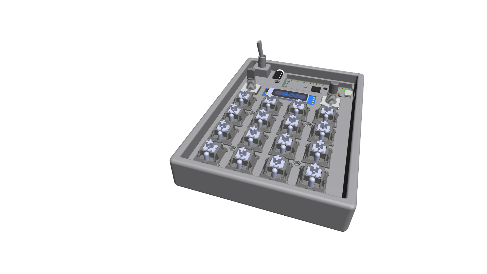

# Twinklepad

This is a small multi task keyboard with 3 custom modes, featuring a TRRS port for double connection, 2 encoders using GPIO and a display for displaying different contents.

---

## Features
1 pcs of 3 step toggle for switching mode
4x4 matrix of key switches
2 pcs of encoders for example slider values such as volume
1 ssd1306 128x32 display for displaying different types of content
1 TRRS port for dual connected modules (could be used for a split keyboard as an example)

---

## Modes

The Twinklepad has 3 modes by default
- Music mode (to the left) - when you press a key it plays a note
- Normal mode (in the middle) - when you press a key it forwards that to the pc as a keycode input
- Calc mode (on the right) - For future calculator mode, able to calculate differents formulas

The current mode for my trinklepad is shown on the display by default.
---

My firmware is written in c from the ground up and has some different features such as:
- Matrix scanning for key inputs
- Encoder control (default: only left is connected to "pitch")
- Display - only capable of displaying mode by default

---

## Hardware

- Raspberry Pi Pico 2 W
- 4x4 MX-style switches  
- 2 pcs Rotary encoders (with push buttons)
- SK6812-MINI-E LEDs 
- SSD1306 128x32 OLED
- Piezo buzzer 4.5 khz
- 3-position mode switch (ON-OFF-ON)

---

## Preview

---

## Getting Started

Clean software:
1. Build with Pico SDK (CMake + Ninja)
2. Flash the `.uf2` file to the Pico
3. Connect via USB and start using HackPad

Use mine?
Just flash the .uf2 file in the fully assembled/production folder.

---

## Notes

This is one of my first times doing something like this.
